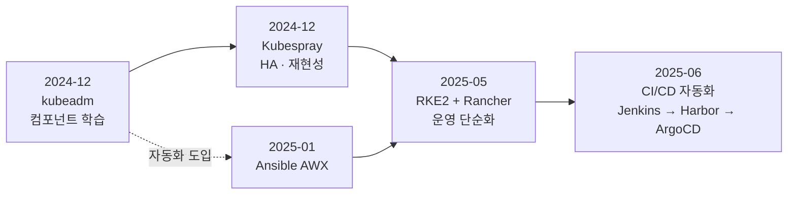

> **이 문서에 기록된 클러스터는 랩 환경입니다.** 배포판과 도구를 직접 세워보고 비교하기 위해 만든 환경이며, 여기 적힌 구성이 그대로 프로덕션이라는 뜻은 아닙니다.
> 다만 여기서 익힌 CI/CD는 **현재 실무 환경에 적용해 파이프라인을 구성하고 있습니다.**
{: .prompt-info }

## 📘 개요

쿠버네티스 클러스터를 세우고, 그 위에 **애플리케이션 배포 전 과정을 자동화(CI/CD)** 하기까지의 기록입니다. 배포판은 kubeadm → Kubespray → RKE2 순으로 옮겨갔고, 배포 파이프라인은 Jenkins · Harbor · ArgoCD를 연결해 구성했습니다.

> **kubeadm은 배우기 위한 선택이었고, RKE2는 운영하기 위한 선택이었다.**
> 그 사이를 Kubespray가 HA와 재현성으로 메웠다.

## 🧭 전체 흐름



## 1️⃣ 클러스터 배포판 — 세 가지를 직접 세워봤다

| 시점 | 선택 | 왜 | 얻은 것 / 한계 |
|---|---|---|---|
| 2024-12 | **kubeadm** | 컨트롤플레인을 직접 조립해 etcd · apiserver · scheduler · CNI가 각각 무엇을 하는지 체득 | 내부 동작 이해. 단일 마스터, CNI(Calico)·대시보드 전부 수동 |
| 2024-12 | **Kubespray** | HA 요구 — 다중 control plane과 etcd 클러스터, Ansible로 재현 가능하게 | 재현성·HA 확보. 플레이북이 무거워 변경 비용이 큼 |
| 2025-05 | **RKE2 + Rancher** | VM 기반 관리 복잡성 해소, Rancher UI로 멀티클러스터 관리, SELinux·etcd 내장 보안, 스크립트 기반 빠른 재구축 | **현재 기본 선택.** Kubespray는 이 시점에 정리 |

kubeadm과 Kubespray는 **같은 날 4시간 간격**으로 구축했습니다. 오래 쓰다 갈아탄 게 아니라, 컴포넌트를 이해한 직후 바로 HA 구성으로 넘어간 기록입니다.

RKE2로 최종 이전한 이유는 클러스터를 **세우는 일**에 쓰는 시간을 줄이고 그 **위에 올리는 일**에 집중하기 위해서였습니다. 단일 바이너리로 etcd와 CNI가 내장되고 인증서 갱신이 자동이라, 재구축이 스크립트 한 번으로 끝납니다.

- [Kubernetes 설치방법](/posts/installing-k8s/) — kubeadm, Calico CNI, 대시보드
- [Kubespray 설치방법](/posts/installing-kubespray/) — Ansible 기반 HA 구성
- [RKE2 + Rancher 설치 매뉴얼](/posts/installing-rke2/) — 현재 사용 중

## 2️⃣ 구성 관리 자동화 — AWX를 네 가지 방식으로

AWX 설치 글이 4편인 건 같은 걸 반복해서가 아니라, **배포 방식을 바꿔가며 옮겨 심은 기록**입니다. 클러스터가 바뀌면 그 위의 도구도 다시 올려야 했습니다.

| 시점 | 방식 | 맥락 |
|---|---|---|
| 2025-01 | 기본 설치 | AWX 자체를 파악. CLI 중심 Ansible에 GUI·REST API·스케줄링을 얹음 |
| 2025-01 | GitHub 연동 | Playbook을 VCS로 관리 — 수동 업로드에서 벗어남 |
| 2025-01 | Helm 배포 | K8s 위로 이동. 일관된 배포 |
| 2025-05 | **AWX Operator** | RKE2 전환에 맞춰 Custom Resource로 재배포. 현재 방식 |

- [Ansible AWX 설치방법](/posts/installing-awx/)
- [AWX Github 연동](/posts/installing-awx-github/)
- [Helm을 이용한 AWX 설치](/posts/installing-awx-helm/)
- [AWX & AWX-Operator 설치](/posts/installing-awx-operator/)

## 3️⃣ CI/CD 자동화 — 코드에서 운영까지

애플리케이션이 코드에서 운영 환경까지 도달하는 전 과정을 자동화하는 것이 목적입니다. 세 도구는 각각 떨어진 설치 대상이 아니라 **하나의 파이프라인**을 이룹니다.

```
코드 커밋 ─▶ Jenkins ─▶ Harbor ─▶ ArgoCD ─▶ 클러스터
             빌드·테스트   이미지 저장   선언적 동기화
                (CI)      (레지스트리)     (CD)
```

CI/CD 도구는 종류가 많습니다. 그중에서 고른 기준은 **범용성**이었습니다. 특정 워크로드에 가장 잘 맞아서가 아니라, 어디를 가도 만날 가능성이 높은 OSS라야 쌓은 것이 남기 때문입니다.

파이프라인을 **IDC 방식과 K8s 네이티브 방식 양쪽으로** 구성한 것도 같은 이유입니다.

| 서비스 | 역할 | 계열 | 고른 이유 |
|---|---|---|---|
| [Jenkins](/posts/installing-jenkins/) | CI — 빌드 파이프라인 | IDC에서 오래 쓰인 방식 | CI 도구 중 **역사가 가장 길고** 플러그인 생태계가 가장 큼 |
| [ArgoCD](/posts/installing-argocd/) | CD — GitOps 선언적 배포 | K8s 네이티브 | K8s GitOps에서 범용적으로 쓰임 |
| [Harbor](/posts/installing-harbor/) | 프라이빗 이미지 레지스트리 | 양쪽 공통 | 온프렘 프라이빗 레지스트리의 범용 선택 |

한쪽만 하면 비교 기준이 생기지 않습니다. Jenkins의 명령형 파이프라인과 ArgoCD의 선언형 동기화를 같은 클러스터에서 돌려보면, 어떤 상황에 무엇이 맞는지가 체감됩니다.

{: .prompt-warning }
> ⚠️ **Jenkins의 대가 — 무겁다**
> 오래된 만큼 플러그인이 많지만, 그만큼 무겁습니다. JVM 기반이라 기본 리소스 점유가 크고, 플러그인 의존성과 버전 충돌 관리가 계속 따라붙습니다. 범용성을 얻는 대신 치르는 비용입니다.

결과적으로 세 서비스 모두 같은 절차로 올라갔습니다.

```
Helm Chart  +  NFS (스토리지)  +  MetalLB (로드밸런서)  +  Ingress
```

온프레미스에는 클라우드의 LoadBalancer와 동적 볼륨 프로비저닝이 없어서 이 조합이 사실상 정해집니다.

{: .prompt-tip }
> 💡 **세 글의 설치 절차가 비슷한 이유**
> 같은 클러스터에 같은 온프렘 제약(LB · 스토리지)으로 올렸기 때문입니다. 처음부터 표준화를 노린 것은 아니지만, 세 번 반복하고 나니 **어디를 검증해야 하는지가 분명해진 절차**가 남았습니다.

### 랩에서 실무로

여기서 구성한 파이프라인을 토대로 **현재는 실무 환경에서 CI/CD를 운영하며 파이프라인을 구축하고 있습니다.** 랩에서 양쪽 계열을 모두 세워본 것이 실무에서 어떤 워크로드에 무엇을 붙일지 판단하는 기준이 됐습니다.

랩 단계에서 Jenkins와 ArgoCD를 함께 올린 판단이 여기서 값을 합니다. 한쪽만 다뤘다면 대응 가능한 범위가 절반으로 줄었을 것입니다.

## 4️⃣ 런타임과 관리 도구

| 도구 | 용도 |
|---|---|
| [Podman & Podman Desktop](/posts/installing-podman/) | 컨테이너 런타임 — 데몬리스 구조로 보안 강화 (`docker` CLI 호환) |
| [Portainer](/posts/installing-portainer/) | 컨테이너·클러스터 GUI 관리 |
| [Kompose](/posts/commands-kompose/) | docker-compose → K8s 매니페스트 변환 |
| [GitLab CE](/posts/installing-gitlab-ce/) | 자체 호스팅 Git 저장소 |
| [OpenStack (Kolla-Ansible)](/posts/installing-kolla-ansible/) | 컨테이너로 배포하는 IaaS |

## 🔍 Decision Log

| 판단 | 선택 | 이유 | 검토한 대안 |
|---|---|---|---|
| 첫 클러스터 | kubeadm | 자동화 도구로 시작하면 내부 구조를 영영 모르게 됨. 한 번은 손으로 조립해봐야 함 | 처음부터 Kubespray/RKE2 |
| HA 구성 | Kubespray | kubeadm 절차를 Ansible로 자동화한 도구라, 손으로 익힌 다음 단계로 자연스러움 | kubeadm 수동 HA(운영 부담 과다) |
| 최종 배포판 | **RKE2** | etcd·CNI 내장, 인증서 자동 갱신, SELinux 기본. 재구축이 스크립트 한 번 | K3s(보안 기능 부족), Kubespray 유지(변경 비용) |
| 도구 선정 기준 | **범용성** | 특정 워크로드 최적화보다, 어디서든 만날 가능성이 높은 OSS라야 쌓은 것이 남음 | — |
| CI 도구 | Jenkins | CI 도구 중 역사가 가장 길고 플러그인 생태계가 가장 큼 | 무겁다는 단점을 감수 |
| 파이프라인 범위 | Jenkins + Harbor + ArgoCD | 빌드 → 이미지 → 배포까지 끊기지 않게 연결. 한 단계만 자동화하면 나머지가 병목 | CI만 구성 |
| 컨테이너 런타임 | **Podman** | **보안 관점의 선택.** 데몬리스라 root 권한으로 상주하는 프로세스가 없고, 컨테이너 탈출 시 노출 범위가 좁음 | Docker(데몬이 root로 상주) |
| 온프렘 L4 | MetalLB | 클라우드 LB가 없는 환경에서 사실상 유일한 현실적 선택 | NodePort(포트 관리 부담) |

{: .prompt-tip }
> 💡 **지금 다시 시작한다면**
> - kubeadm 단계는 **그대로 반복할 것**입니다. 컴포넌트를 모르면 RKE2에서 문제가 생겼을 때 원인을 못 찾습니다.
> - Kubespray 단계는 건너뛰고 kubeadm → RKE2로 바로 갈 것입니다. HA는 RKE2가 더 쉽게 해결합니다.

## 관련 기록

- [Enterprise LLMOps AI 거버넌스 구축 매뉴얼](/posts/installing-llmops-ai-governance/) — 이 플랫폼 위에 올리는 AI 워크로드
- [Harbor 설치](/posts/installing-harbor/) — 공급망 통제의 출발점
