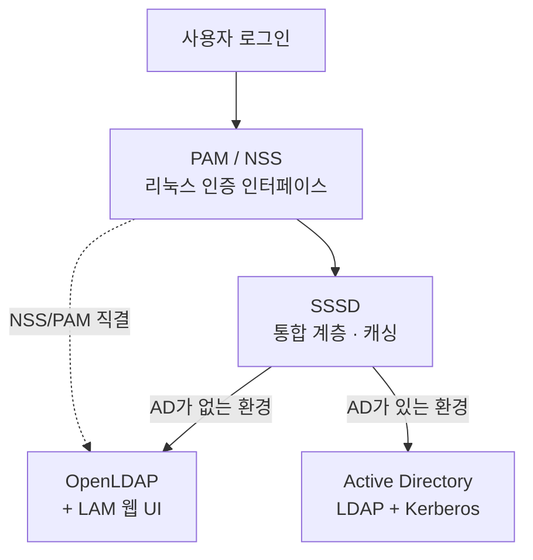

> **IDC와 클라우드 양쪽 서버를 AD로 통합해 실제 운영 환경에서 사용 중인 구성입니다.**
{: .prompt-info }

## 📘 개요

리눅스 서버의 계정을 **AD 한 곳에서 관리**하기 위해 구성한 기록입니다. 디렉터리 서버는 환경에 따라 OpenLDAP과 Active Directory로 달랐지만, 리눅스를 붙이는 계층은 SSSD로 같았습니다.

서버별로 로컬 계정을 관리하면 세 가지가 전부 수동이 됩니다.

- **입사** — 서버마다 `useradd`. 서버가 늘면 그만큼 반복
- **퇴사** — 계정이 삭제되지 않고 남습니다. 어느 서버에 무엇이 남았는지 확인할 방법이 없습니다
- **정책** — 90일 비밀번호 만료, 5회 실패 시 잠금, 복잡도 요구사항을 서버마다 설정하고 계속 맞춰야 합니다

세 번째가 가장 감당하기 어렵습니다. 서버가 몇 대만 넘어가면 **정책이 서버마다 조금씩 달라지고**, 어느 서버가 기준을 만족하는지 아무도 답할 수 없게 됩니다.

AD에 연동하면 이 셋이 한 지점으로 모입니다. 계정 생성과 삭제가 AD에서 끝나고, 비밀번호 정책·잠금 정책·복잡도는 **AD 정책을 그대로 따라갑니다.** 정책을 바꿀 때 AD에서 한 번 바꾸면 연동된 전 서버에 반영됩니다.

> **OpenLDAP은 AD가 없는 환경에서의 선택이었고, AD는 이미 AD가 있는 환경에서의 선택이다.**
> 바뀐 것은 디렉터리 서버이고, 리눅스를 통합하는 방식은 그대로였다.

## 🎯 AD 연동으로 넘어가는 것

리눅스 서버에서 직접 관리하던 항목이 AD 정책으로 위임됩니다. 오른쪽 열이 연동 후 관리 지점입니다.

| 항목 | 서버별 관리 | AD 연동 후 |
|---|---|---|
| 계정 생성 | 서버마다 `useradd` | AD에서 1회 |
| 계정 삭제 | 서버마다 `userdel` — **누락 발생** | AD에서 비활성화 → 전 서버 즉시 차단 |
| 비밀번호 만료 (90일) | 서버마다 `chage` / PAM 설정 | AD 정책 |
| 계정 잠금 (5회 실패) | 서버마다 `pam_faillock` | AD 정책 |
| 비밀번호 복잡도 | 서버마다 `pam_pwquality` | AD 정책 |
| sudo 권한 | 서버마다 `sudoers` | AD 그룹 기반 |

{: .prompt-tip }
> 💡 **정책을 한 곳에 두는 것의 실제 값**
> 서버가 늘어나도 **관리 지점이 늘지 않습니다.** 정책 변경 요구가 들어왔을 때 AD에서 한 번 바꾸면 끝이고, "전 서버가 기준을 만족하는가"라는 질문에 근거를 가지고 답할 수 있습니다.

## 🧭 계정이 인증되는 경로

디렉터리 서버가 무엇이든 리눅스 쪽 구성은 SSSD 한 계층으로 흡수됩니다. 백엔드를 갈아끼워도 PAM/NSS 위쪽은 건드릴 일이 없습니다.

## 1️⃣ 디렉터리 서버 — 환경이 결정한다

| | OpenLDAP | Active Directory |
|---|---|---|
| 언제 | **AD가 없는 환경** | **AD가 이미 있는 환경 (현재)** |
| 성격 | 오픈소스, RFC 4510 등 LDAP 표준 준수 | LDAP + Kerberos + DNS를 묶은 Microsoft 통합 스택 |
| 구축 부담 | 스키마 · DIT · 인덱스까지 직접 설계 | 이미 운영 중인 것을 연동 |
| 관리 UI | LAM(LDAP Account Manager) 별도 구축 | 기본 제공 |

디렉터리 서버 선택은 취향 문제가 아닙니다. **조직에 AD가 있으면 AD를 쓰는 게 맞습니다.** 계정 소스를 둘로 나누는 순간 동기화 문제가 생기고, 어느 쪽이 정본인지 불분명해집니다.

OpenLDAP을 직접 세워본 경험은 AD 환경으로 옮긴 뒤에도 남습니다. DN·속성·스키마를 손으로 다뤄봤으면 AD의 LDAP 질의도 같은 개념으로 읽히기 때문입니다.

- [OpenLDAP 설치 매뉴얼](/posts/installing-openldap/) — 서버 구축, LAM 웹 UI, DN/속성 구조
- [AD(Active Directory) 사용법](/posts/commands-activedirectory/) — 구성요소와 PowerShell 계정 운영

## 2️⃣ 리눅스 통합 계층 — 직결과 SSSD를 모두

OpenLDAP 구축 당시 클라이언트를 **두 가지 방식으로** 붙여봤습니다.

| 방식 | 구성 | 위치 |
|---|---|---|
| **A. LDAP 클라이언트 직결** | `nss-pam-ldapd` 계열로 LDAP에 바로 질의 | 오래 쓰인 방식. 현재는 레거시 |
| **B. SSSD** | SSSD가 중간에서 인증·조회를 대행 | **현행 표준.** 캐싱으로 서버 단절 시에도 로그인 유지 |

**SSSD를 택한 이유는 그것이 현재 방식이기 때문입니다.** `nss_ldap` 계열은 Red Hat 계열에서 SSSD로 대체된 지 오래고, 새로 구성하면서 굳이 물러난 방식을 쓸 이유가 없었습니다.

부수적으로, AD 환경으로 옮길 때 SSSD 구성을 그대로 재사용할 수 있었습니다. 백엔드만 `ldap`에서 `ad`로 바꾸면 되고 PAM/NSS 설정, 홈 디렉터리 자동 생성, sudo 연동 구조는 동일합니다. 의도한 이점은 아니었지만 결과적으로 이전 비용을 크게 줄였습니다.

- [SSSD & Active Directory 연동 가이드](/posts/installing-sssd-ad/) — 도메인 Join, `sssd.conf`, authselect, sudo 권한

{: .prompt-tip }
> 💡 **DNS가 깨지면 SSSD도 끝입니다**
> AD 연동은 SRV 레코드(`_ldap._tcp`, `_kerberos._tcp`)로 서버를 자동 탐색합니다. 도메인 Join 전에 `nslookup -type=SRV`로 먼저 확인해야 원인 불명의 실패를 피할 수 있습니다.

## 3️⃣ 공유 자격증명 — 같은 생애주기의 다른 축

Vaultwarden은 디렉터리 서비스가 아니라 **비밀번호 저장소**입니다. 인증 경로에 끼어드는 구성요소는 아니지만, 계정관리와 무관하지도 않습니다.

**입퇴사 때 정리해야 할 것이 개인 계정만은 아니기 때문입니다.** 팀이 공유하던 장비 계정, 서비스 자격증명, API 키가 어디에 어떤 형태로 있는지 파악되지 않으면 퇴사 처리가 절반만 끝난 상태가 됩니다. 공유 비밀번호를 한 곳에 모아두면 그 부분도 같이 회수할 수 있습니다.

**사내에서 쓸 비밀번호 관리 도구가 필요했습니다.** 1Password는 사용해보니 좋았지만 유료였고, 인원수만큼 라이선스 비용이 붙습니다. Vaultwarden은 Bitwarden 호환 서버를 경량으로 구현한 OSS라서, 같은 클라이언트 생태계를 그대로 쓰면서 비용 없이 자체 호스팅할 수 있습니다.

자체 호스팅은 부수 효과도 있습니다. 민감한 비밀번호 데이터가 외부 클라우드에 나가지 않습니다.

- [Vaultwarden 설치 가이드](/posts/installing-vaultwarden/) — 자체 호스팅 비밀번호 관리

## 🔍 Decision Log

| 판단 | 선택 | 이유 | 검토한 대안 |
|---|---|---|---|
| 계정 관리 범위 | **디렉터리 단일화** | 입퇴사를 한 곳에서 끝내야 함. 서버별 로컬 계정은 퇴사 시 잔존 계정을 확신할 수 없음 | 서버별 로컬 계정 유지 |
| 계정 정책 | **AD 정책에 위임** | 만료·잠금·복잡도를 서버마다 설정하면 정책 편차가 생기고, 전 서버 준수 여부를 답할 수 없음 | 서버별 PAM 설정 개별 관리 |
| 디렉터리 서버 | **환경을 따름** — AD 없으면 OpenLDAP, 있으면 AD | 계정 소스가 둘이면 정본이 불분명해지고 입퇴사 처리도 두 번 해야 함 | OpenLDAP 유지 후 AD와 병행 |
| 리눅스 통합 방식 | **SSSD** | 현행 표준. `nss_ldap` 계열은 이미 SSSD로 대체된 레거시 | LDAP 클라이언트 직결(구방식 유지) |
| 관리 UI | LAM | OpenLDAP은 기본 UI가 없어 별도 구축 필요 | CLI만 사용 |
| 비밀번호 저장소 | **Vaultwarden** | 사내 사용 기준 — 1Password는 좋았으나 인원수만큼 유료. OSS로 같은 클라이언트 생태계를 무상 자체 호스팅 | 1Password(유료), Bitwarden 클라우드 |

{: .prompt-tip }
> 💡 **두 환경을 모두 겪은 것의 값**
> AD만 다뤄본 사람은 디렉터리를 처음부터 설계하지 못하고, OpenLDAP만 다뤄본 사람은 Windows 중심 조직에 붙이지 못합니다. 스키마를 손으로 짜본 경험과 기존 AD에 통합해본 경험은 서로를 대체하지 않습니다.

## 관련 기록

- [컨테이너 플랫폼 구축 기록 — kubeadm에서 RKE2까지](/posts/overview-container-platform/) — 같은 인프라 위의 플랫폼 계층
- [Enterprise LLMOps AI 거버넌스 구축 매뉴얼](/posts/installing-llmops-ai-governance/) — SSO·RBAC이 진입 통제로 쓰이는 사례
