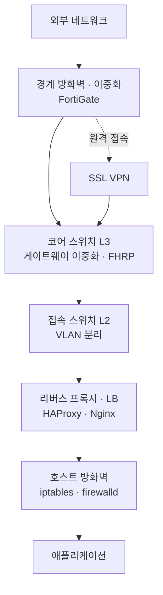

> **글마다 환경이 다릅니다.** 각 절에 `현업 사용 중` · `과거 실무` · `랩` 으로 표기했습니다.
{: .prompt-info }

## 📘 개요

네트워크를 다룬 기록을 **담당 계층별로** 묶었습니다. 물리 스위치부터 방화벽, 로드밸런서, 인증서까지입니다. 아래 흐름도는 실제 패킷이 지나가는 경로이고, 이어지는 절은 계층별 묶음이라 순서가 다릅니다.

계층마다 다루는 장비와 도구가 다르고, 한 계층만 알아도 문제를 못 잡습니다. 예를 들어 "웹 서비스가 안 열린다"는 신고 하나에도 스위치 포트, 게이트웨이, 방화벽 정책, 리버스 프록시, 인증서 만료가 전부 후보입니다.

## 🧭 계층별 담당

경계에서 한 번 거르고, 코어에서 라우팅과 게이트웨이 이중화를 처리하고, 접속 계층에서 VLAN으로 나누고, 서버 앞단에서 프록시가 받고, **마지막으로 서버 자신의 방화벽이 거릅니다.** 호스트 방화벽은 앞단이 뚫렸을 때를 위한 마지막 관문이라 프록시와 병렬이 아니라 그 뒤에 옵니다.

## 1️⃣ 물리 스위치 — Cisco Catalyst

`과거 실무`

실제 운용했던 장비를 다룬 기록입니다. 콘솔 케이블을 물리고 IOS를 올려본 경험은 가상 환경으로 대체되지 않습니다. 특히 **장비가 부팅되지 않는 상황**은 문서로 읽는 것과 직접 겪는 것의 차이가 큽니다.

| 작업 | 기록 | 성격 |
|---|---|---|
| 초기 설정 | [Cisco Switch 기본 설정](/posts/commands-cisco-base-setting/) | VLAN · 포트 · 보안 기본값 |
| 공장 초기화 | [Cisco Catalyst 2960 공장 초기화](/posts/commands-c2960s-factory-reset/) | 설정 오류 복구, 환경 전환 |
| **IOS 복구** | [Cisco Switch 복구 X/Y/Z MODEM](/posts/commands-cisco-switch-serial-transmission/) | 네트워크·USB 불가 시 **시리얼로 IOS 전송** |
| 대역 제한 | [Bandwidth Limit 설정](/posts/commands-cisco-switch-limit/) | QoS — 시간대별 대역폭 제한 |
| 게이트웨이 이중화 | [FHRP 설정](/posts/commands-fhrp/) | L3 — 디폴트 게이트웨이 장애 대비 |
| 접근 제어 | [로그인 제어 설정](/posts/commands-cisco-login-acl/) | 구형 IOS 제약 우회 |

{: .prompt-tip }
> 💡 **구형 장비에서는 최선이 아니라 차선을 찾아야 합니다**
> 로그인 제어 기록은 `ip ssh pubkey-chain`을 지원하지 않는 오래된 IOS에서 나온 것입니다. SSH 키 인증이 불가능하니 **IP 기반 접근 제어로 최소한의 보안을 확보**하는 방향으로 갔습니다. 장비를 바꿀 수 없을 때 무엇을 포기하고 무엇을 지킬지 정하는 판단이 필요했습니다.

## 2️⃣ 경계 방어 — 원격 접속과 방화벽

### FortiGate SSL VPN

`현업 사용 중`

사내 네트워크로 들어오는 원격 접속 경로입니다. 상용 장비라 설치보다 **설정과 운영**이 기록의 중심이고, 초기에 익힐 때 잊지 않으려고 남긴 문서입니다.

- [FortiGate SSL VPN 설정](/posts/installing-fortigate-sslvpn/)

### OPNsense HAProxy

`실제 운영`

도입 이유가 기록에 명확히 남아 있습니다.

> **L4/L7 하드웨어 로드밸런서의 고비용 구조를 대체**하고자, OPNsense의 HAProxy 플러그인을 활용하여 소규모 트래픽 환경에서 경제적이면서도 안정적인 로드밸런싱을 구현

트래픽 규모가 크지 않은 환경에서 전용 LB 장비를 사는 것은 과투자입니다. 이미 방화벽으로 쓰는 OPNsense에 HAProxy 플러그인을 얹으면 같은 일을 합니다.

- [OPNsense HAProxy 사용법](/posts/installing-opnsense-haproxy/)

## 3️⃣ 호스트 방화벽 — iptables와 firewalld 둘 다

`필수 기본기`

두 도구는 전환 관계가 아닙니다. **서버를 다루면 둘 다 알고 있어야 합니다.**

| | iptables | firewalld |
|---|---|---|
| 방식 | 규칙을 직접 나열 | zone 기반 정책 |
| 내부 구현 | 커널 netfilter 직접 | 내부적으로 nftables/iptables 사용 |
| 만나는 곳 | 오래된 시스템, 레거시 스크립트 | RHEL 계열 최근 배포판 기본 |

firewalld를 쓰는 서버라도 문제가 생기면 결국 하위 규칙을 봐야 하고, iptables만 알면 zone 개념이 있는 환경에서 헤맵니다. 어느 하나로 대체되지 않습니다.

- [IPtables 사용법](/posts/commands-iptables/) — SSH·ICMP만 허용하는 **화이트리스트 최소 정책**
- [Firewalld 사용법](/posts/commands-firewalld/) — zone 기반 정책 관리

## 4️⃣ L7 — 리버스 프록시와 인증서

### Nginx Proxy Manager

`랩`

Nginx 설정을 GUI로 다룰 수 있어 확인해본 구성입니다. Kubernetes에 Helm으로 배포하고 MariaDB · NFS · cert-manager까지 붙였습니다.

- [Nginx Proxy Manager 설치](/posts/installing-nginx-proxy-manager/)

### Certbot

`도구`

Let's Encrypt 인증서 발급·갱신 자동화입니다. 인증서 만료는 예고 없이 서비스를 멈추게 하므로 갱신 자동화가 사실상 필수입니다.

- [Certbot SSL 인증서 발급 방법](/posts/commands-certbot/)

## 🔍 Decision Log

| 판단 | 선택 | 이유 | 검토한 대안 |
|---|---|---|---|
| 로드밸런서 | **OPNsense HAProxy** | 소규모 트래픽에 전용 LB 장비는 과투자. 기존 방화벽 장비를 재활용 | L4/L7 하드웨어 LB(고비용) |
| 호스트 방화벽 | **둘 다 습득** | 배포판·세대에 따라 만나는 도구가 다름. 하나만 알면 나머지 환경에서 막힘 | 한쪽만 선택 |
| 구형 IOS 접근 제어 | **IP 기반 ACL** | SSH 키 인증 미지원 장비. 장비 교체가 불가하니 가능한 통제로 대체 | SSH 키 인증(장비 미지원) |
| 인증서 | **Certbot 자동 갱신** | 수동 갱신은 반드시 잊습니다. 만료는 예고 없이 서비스를 멈춤 | 수동 발급·갱신 |

{: .prompt-tip }
> 💡 **계층을 넘나드는 것의 값**
> 물리 스위치를 만져본 사람은 "포트가 죽었나"를 후보에 넣고, 방화벽을 아는 사람은 "정책에 막혔나"를 넣고, 프록시를 아는 사람은 "인증서가 만료됐나"를 넣습니다. 장애 원인 후보를 얼마나 넓게 잡을 수 있는지가 계층 경험의 폭에서 나옵니다.

## 관련 기록

- [컨테이너 플랫폼 구축 기록 — kubeadm에서 RKE2까지](/posts/overview-container-platform/) — MetalLB·Ingress로 이어지는 클러스터 내부 네트워킹
- [계정관리 구축 기록 — OpenLDAP에서 AD 연동까지](/posts/overview-identity-management/) — 장비·서버 접근 계정의 중앙 관리
